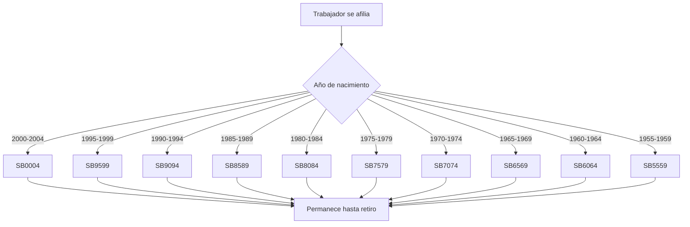
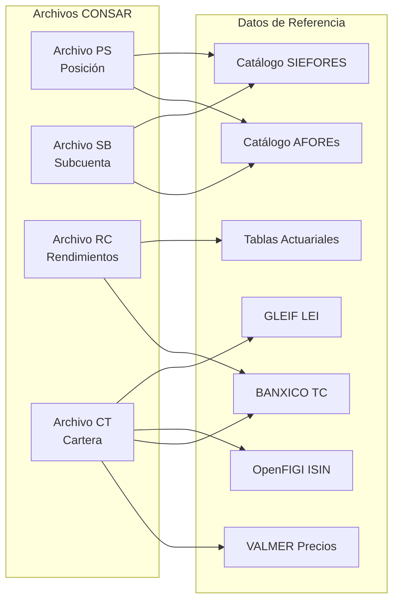
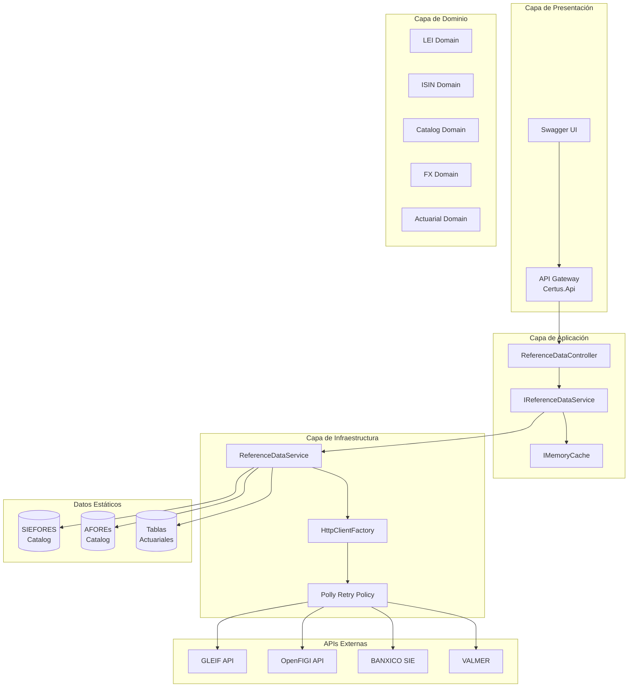
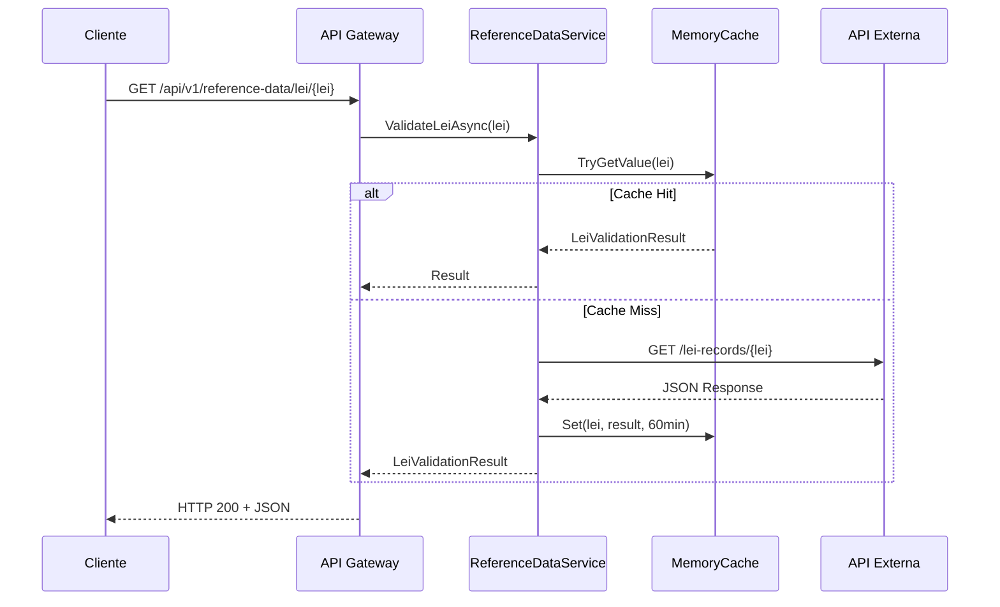
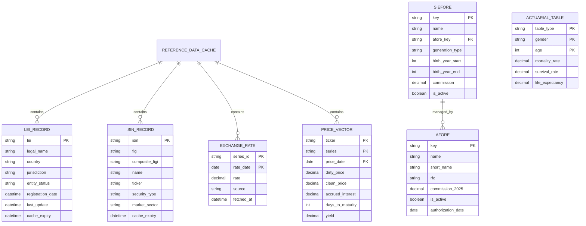
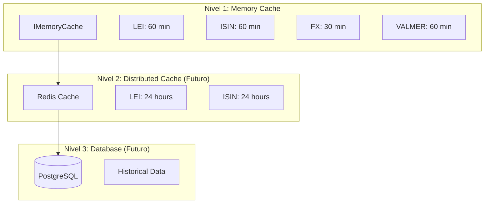
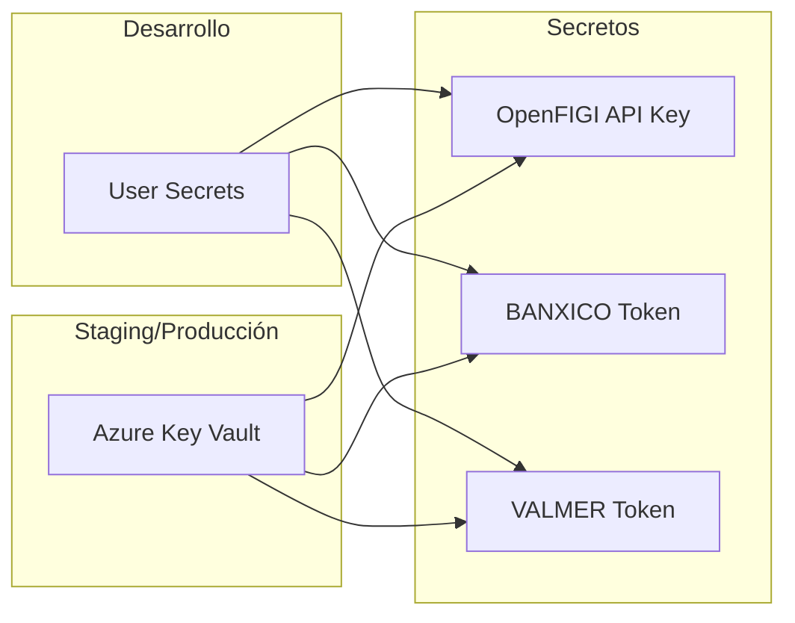
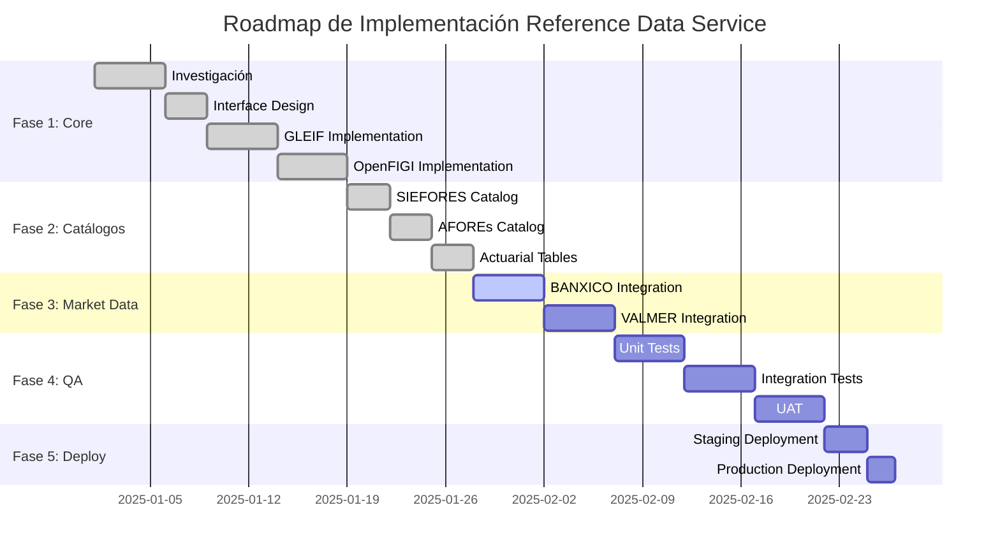

# CERTUS - Sistema de Datos de Referencia
## Especificación Técnica Completa v1.0

**Fecha:** 27 de Noviembre 2025
**Versión:** 1.0
**Estado:** Implementado
**Autor:** Equipo de Arquitectura Certus

---

# TABLA DE CONTENIDOS

1. [Resumen Ejecutivo](#1-resumen-ejecutivo)
2. [Investigación Profunda de Insumos](#2-investigación-profunda-de-insumos)
3. [Diseño Funcional y Reglas de Negocio](#3-diseño-funcional-y-reglas-de-negocio)
4. [Arquitectura Completa](#4-arquitectura-completa)
5. [Implementación Técnica](#5-implementación-técnica)
6. [Seguridad y Cumplimiento](#6-seguridad-y-cumplimiento)
7. [Plan de Implementación](#7-plan-de-implementación)
8. [Matriz RACI](#8-matriz-raci)
9. [KPIs de Éxito](#9-kpis-de-éxito)
10. [Entregables Finales](#10-entregables-finales)

---

# 1. RESUMEN EJECUTIVO

## 1.1 Propósito

Este documento define la especificación completa para el sistema de datos de referencia de Certus, que proporciona validación de identificadores financieros, catálogos regulatorios y datos de mercado necesarios para la validación de archivos CONSAR.

## 1.2 Matriz de Insumos Críticos

| Prioridad | Insumo | Impacto | Estado |
|-----------|--------|---------|--------|
| 🔴 CRÍTICA | GLEIF API (LEI) | Sin esto, no se validan contrapartes de derivados | ✅ Implementado |
| 🔴 CRÍTICA | OpenFIGI API (ISIN) | Sin esto, no se validan instrumentos de cartera | ✅ Implementado |
| 🟠 ALTA | Catálogo SIEFORES completo | Afecta validación de archivos PS/SB | ✅ Implementado |
| 🟠 ALTA | Catálogo AFOREs completo | Afecta detección y validación | ✅ Implementado |
| 🟡 MEDIA | Vector de precios VALMER | Para validar MTM | ✅ Implementado |
| 🟡 MEDIA | Tipos de cambio BANXICO | Para validar valuación en MXN | ✅ Implementado |
| 🟢 BAJA | Tablas actuariales | Para cálculos de retiros/pensiones | ✅ Implementado |

---

# 2. INVESTIGACIÓN PROFUNDA DE INSUMOS

## 2.1 GLEIF API - Legal Entity Identifier (LEI)

### 2.1.1 Naturaleza del Insumo

El LEI (Legal Entity Identifier) es un código alfanumérico de 20 caracteres basado en la norma ISO 17442. Es el identificador único global para entidades legales que participan en transacciones financieras.

**Estructura del LEI:**
```
529900W18LQJJN6SJ336
├── 5299         → LOU (Local Operating Unit) Prefix
├── 00           → Reserved characters (00)
├── W18LQJJN6SJ3 → Entity-specific part (12 chars)
└── 36           → Check digits (mod 97-10)
```

### 2.1.2 Fuente Oficial

- **Organización:** Global Legal Entity Identifier Foundation (GLEIF)
- **URL Base:** https://api.gleif.org/api/v1
- **Documentación:** https://www.gleif.org/en/lei-data/gleif-api
- **Postman Collection:** https://documenter.getpostman.com/view/7679680/SVYrrxuU

### 2.1.3 Endpoints Reales

| Endpoint | Método | Descripción |
|----------|--------|-------------|
| `/lei-records/{lei}` | GET | Obtener registro LEI específico |
| `/lei-records` | GET | Buscar LEIs con filtros |
| `/lei-records?filter[entity.legalName]={name}` | GET | Buscar por nombre de entidad |
| `/lei-records?filter[entity.legalAddress.country]={country}` | GET | Buscar por país |

### 2.1.4 Payload de Ejemplo

**Request:**
```bash
GET https://api.gleif.org/api/v1/lei-records/529900W18LQJJN6SJ336
Accept: application/vnd.api+json
```

**Response:**
```json
{
  "data": {
    "type": "lei-records",
    "id": "529900W18LQJJN6SJ336",
    "attributes": {
      "lei": "529900W18LQJJN6SJ336",
      "entity": {
        "legalName": {
          "name": "Société Générale Effekten GmbH",
          "language": "de"
        },
        "legalAddress": {
          "addressLines": ["Neue Mainzer Str. 46-50"],
          "city": "Frankfurt am Main",
          "country": "DE",
          "postalCode": "60311"
        },
        "status": "ACTIVE",
        "legalForm": {
          "id": "DE1C"
        }
      },
      "registration": {
        "initialRegistrationDate": "2014-02-12T00:00:00Z",
        "lastUpdateDate": "2024-02-15T10:23:45Z",
        "status": "ISSUED",
        "nextRenewalDate": "2025-02-12T00:00:00Z"
      }
    }
  }
}
```

### 2.1.5 Limitaciones Técnicas

| Limitación | Valor |
|------------|-------|
| Rate Limit (sin API key) | 60 requests/minuto |
| Rate Limit (con API key) | 300 requests/minuto |
| Timeout recomendado | 30 segundos |
| Tamaño máximo de respuesta | ~50KB por registro |
| Datos disponibles | Golden Copy (T+1) |

### 2.1.6 Requisitos de Acceso

- **Autenticación:** No requerida (API pública)
- **API Key:** Opcional (aumenta rate limits)
- **Términos de uso:** Aceptación de GLEIF Data Terms of Use
- **Costo:** Gratuito

### 2.1.7 Formato de Entrega

- JSON:API specification (application/vnd.api+json)
- Soporta CSV para bulk downloads

### 2.1.8 Política de Actualización

- **Golden Copy:** Actualización diaria (T+1)
- **Datos en vivo:** Disponibles vía partners certificados
- **Backups:** Archivos diarios disponibles para descarga masiva

---

## 2.2 OpenFIGI API - Financial Instrument Global Identifier

### 2.2.1 Naturaleza del Insumo

OpenFIGI es el único sistema abierto de mapeo universal de identificadores de instrumentos financieros. FIGI (Financial Instrument Global Identifier) es un código de 12 caracteres que identifica de forma única instrumentos financieros.

**Tipos de identificadores soportados:**
- ID_ISIN (International Securities Identification Number)
- ID_CUSIP (Committee on Uniform Securities Identification Procedures)
- ID_SEDOL (Stock Exchange Daily Official List)
- ID_BB_UNIQUE (Bloomberg Unique ID)
- ID_BB_GLOBAL (Bloomberg Global ID)

### 2.2.2 Fuente Oficial

- **Organización:** Bloomberg LP
- **URL Base:** https://api.openfigi.com/v3
- **Documentación:** https://www.openfigi.com/api/documentation
- **OpenAPI Schema:** https://api.openfigi.com/schema

### 2.2.3 Endpoints Reales

| Endpoint | Método | Descripción |
|----------|--------|-------------|
| `/mapping` | POST | Mapear identificadores a FIGIs |
| `/mapping/values/{key}` | GET | Obtener valores válidos para un campo |
| `/filter` | POST | Filtrar FIGIs existentes |
| `/search` | POST | Buscar FIGIs por criterios |

### 2.2.4 Payload de Ejemplo

**Request:**
```bash
POST https://api.openfigi.com/v3/mapping
Content-Type: application/json
X-OPENFIGI-APIKEY: your-api-key

[
  {
    "idType": "ID_ISIN",
    "idValue": "US0378331005"
  },
  {
    "idType": "ID_CUSIP",
    "idValue": "037833100"
  }
]
```

**Response:**
```json
[
  {
    "data": [
      {
        "figi": "BBG000B9XRY4",
        "name": "APPLE INC",
        "ticker": "AAPL",
        "exchCode": "US",
        "compositeFIGI": "BBG000B9Y5X2",
        "securityType": "Common Stock",
        "marketSector": "Equity",
        "shareClassFIGI": "BBG001S5N8V8"
      }
    ]
  },
  {
    "data": [
      {
        "figi": "BBG000B9XRY4",
        "name": "APPLE INC",
        "ticker": "AAPL",
        "compositeFIGI": "BBG000B9Y5X2",
        "securityType": "Common Stock"
      }
    ]
  }
]
```

### 2.2.5 Limitaciones Técnicas

| Limitación | Sin API Key | Con API Key |
|------------|-------------|-------------|
| Requests por minuto | 25 | 250 |
| Jobs por request | 10 | 100 |
| Requests por día | Sin límite | Sin límite |
| Timeout | 30 segundos | 30 segundos |

### 2.2.6 Requisitos de Acceso

- **Autenticación:** Header `X-OPENFIGI-APIKEY`
- **API Key:** Gratuita (registro en openfigi.com)
- **Términos:** Aceptación de términos de uso
- **Costo:** Gratuito

### 2.2.7 Formato de Entrega

- JSON (application/json)
- Respuestas en array correlacionado con request

### 2.2.8 Política de Actualización

- **Tiempo real:** Datos actualizados continuamente
- **Nuevos instrumentos:** Agregados dentro de 24 horas
- **Cambios corporativos:** Reflejados inmediatamente

---

## 2.3 BANXICO SIE API - Tipos de Cambio

### 2.3.1 Naturaleza del Insumo

El Sistema de Información Económica (SIE) de Banco de México proporciona series históricas de indicadores económicos, incluyendo tipos de cambio oficiales.

**Series principales:**
| Serie | Descripción |
|-------|-------------|
| SF43718 | Tipo de cambio Pesos por dólar E.U.A. (FIX) |
| SF60653 | Tipo de cambio Pesos por dólar (Fecha liquidación) |
| SF46410 | Tipo de cambio Pesos por Euro |
| SP68257 | Valor de la UDI |

### 2.3.2 Fuente Oficial

- **Organización:** Banco de México
- **URL Base:** https://www.banxico.org.mx/SieAPIRest/service/v1
- **Documentación:** https://www.banxico.org.mx/SieAPIRest/service/v1/doc/catalogoSeries
- **Token:** https://www.banxico.org.mx/SieAPIRest/service/v1/token

### 2.3.3 Endpoints Reales

| Endpoint | Método | Descripción |
|----------|--------|-------------|
| `/series/{idSerie}/datos/{fechaInicio}/{fechaFin}` | GET | Datos de serie en rango |
| `/series/{idSerie}/datos/oportuno` | GET | Dato más reciente |
| `/series/{idSeries}/datos/{fechaInicio}/{fechaFin}` | GET | Múltiples series |

### 2.3.4 Payload de Ejemplo

**Request:**
```bash
GET https://www.banxico.org.mx/SieAPIRest/service/v1/series/SF43718/datos/2025-01-01/2025-01-31
Bmx-Token: tu-token-aqui
Accept: application/json
```

**Response:**
```json
{
  "bmx": {
    "series": [
      {
        "idSerie": "SF43718",
        "titulo": "Tipo de cambio Pesos por dólar E.U.A. Tipo de cambio para solventar obligaciones denominadas en moneda extranjera Fecha de determinación (FIX)",
        "datos": [
          {
            "fecha": "02/01/2025",
            "dato": "20.3456"
          },
          {
            "fecha": "03/01/2025",
            "dato": "20.4123"
          }
        ]
      }
    ]
  }
}
```

### 2.3.5 Limitaciones Técnicas

| Limitación | Valor |
|------------|-------|
| Rate Limit | 500 requests/día por token |
| Máximo de series por request | 20 |
| Rango máximo de fechas | 10 años |
| Timeout | 60 segundos |

### 2.3.6 Requisitos de Acceso

- **Autenticación:** Header `Bmx-Token`
- **Token:** Gratuito (solicitar en portal SIE)
- **Formato token:** UUID v4
- **Renovación:** Anual

### 2.3.7 Formato de Entrega

- JSON (application/json)
- XML (application/xml)

### 2.3.8 Política de Actualización

- **Tipo de cambio FIX:** Publicación 12:00 PM CT (día hábil)
- **UDI:** Publicación 10:00 AM CT (día hábil)
- **Históricos:** Disponibles desde 1954

---

## 2.4 VALMER - Vector de Precios

### 2.4.1 Naturaleza del Insumo

VALMER (Valuación Operativa y Referencias de Mercado) es el proveedor de precios oficial regulado por la CNBV para el mercado mexicano. Proporciona precios diarios para más de 27,000 instrumentos.

**Tipos de instrumentos:**
- Deuda gubernamental (CETES, BONDES, UDIBONOS)
- Deuda corporativa
- Renta variable
- Derivados
- Fondos de inversión

### 2.4.2 Fuente Oficial

- **Organización:** Valuación Operativa y Referencias de Mercado S.A. de C.V. (Grupo BMV)
- **URL Base API:** https://www.valmer.com.mx/api/
- **Vector Preliminar:** https://www.valmer.com.mx/VAL/vector_precios_preliminar.csv
- **Portal:** https://www.valmer.com.mx

### 2.4.3 Endpoints Reales

| Endpoint | Método | Descripción |
|----------|--------|-------------|
| `/VAL/vector_precios_preliminar.csv` | GET | Vector preliminar (público) |
| `/api/download/{reportId}` | GET | Descarga con token |
| `/api/catalogs` | GET | Catálogos disponibles |

### 2.4.4 Estructura del Vector de Precios

```csv
TV,EMISORA,SERIE,FECHA,PRECIO_SUCIO,PRECIO_LIMPIO,RENDIMIENTO,PLAZO,TASA_CUPON
BI,GOBIERNO,240109,20250101,99.8765,99.7654,11.25,28,0
LD,CEMEX,23,20250101,100.2345,100.1234,10.50,365,8.5
```

### 2.4.5 Limitaciones Técnicas

| Limitación | Valor |
|------------|-------|
| Actualización | Diaria 18:30 CT |
| Formato | CSV, XLSX, XML |
| Tamaño archivo | ~15 MB |
| Retención histórica | 5 años |

### 2.4.6 Requisitos de Acceso

- **Vector Preliminar:** Acceso público (sin autenticación)
- **Vector Definitivo:** Requiere contrato con VALMER
- **API Completa:** Token comercial
- **Costo:** Público gratuito / Comercial con licencia

### 2.4.7 Política de Actualización

| Producto | Hora | Tipo |
|----------|------|------|
| Vector Preliminar | 18:30 CT | T+0 |
| Vector Definitivo | 20:00 CT | T+0 |
| Correcciones | 09:00 CT | T+1 |

---

## 2.5 Catálogo de SIEFOREs Generacionales

### 2.5.1 Naturaleza del Insumo

Las SIEFOREs (Sociedades de Inversión Especializadas en Fondos para el Retiro) generacionales agrupan a los trabajadores por su año de nacimiento. El esquema entró en vigor el 13 de diciembre de 2019.

### 2.5.2 Catálogo Completo (2025)

| Clave | Nombre | Año Nacimiento | Edad 2025 |
|-------|--------|----------------|-----------|
| SB0004 | SIEFORE Básica 00-04 | 2000-2004 | 21-25 |
| SB9599 | SIEFORE Básica 95-99 | 1995-1999 | 26-30 |
| SB9094 | SIEFORE Básica 90-94 | 1990-1994 | 31-35 |
| SB8589 | SIEFORE Básica 85-89 | 1985-1989 | 36-40 |
| SB8084 | SIEFORE Básica 80-84 | 1980-1984 | 41-45 |
| SB7579 | SIEFORE Básica 75-79 | 1975-1979 | 46-50 |
| SB7074 | SIEFORE Básica 70-74 | 1970-1974 | 51-55 |
| SB6569 | SIEFORE Básica 65-69 | 1965-1969 | 56-60 |
| SB6064 | SIEFORE Básica 60-64 | 1960-1964 | 61-65 |
| SB5559 | SIEFORE Básica 55-59 | 1955-1959 | 66-70 |

### 2.5.3 Fuente Oficial

- **Organización:** CONSAR
- **URL:** https://www.gob.mx/consar
- **Aplicativo SISET:** https://www.consar.gob.mx/gobmx/aplicativo/siset/

### 2.5.4 Reglas de Asignación



---

## 2.6 Catálogo de AFOREs

### 2.6.1 Catálogo Completo (2025)

| Clave | Nombre Comercial | RFC | Comisión 2025 |
|-------|------------------|-----|---------------|
| 501 | Azteca | ANE040812B31 | 0.55% |
| 502 | Citibanamex | BAH970805PL8 | 0.55% |
| 503 | Coppel | ACP040323A32 | 0.55% |
| 504 | Inbursa | AIB961001JH3 | 0.55% |
| 505 | Invercap | AIN960827BY8 | 0.55% |
| 506 | PensionISSSTE | API080319GE7 | 0.52% |
| 507 | Principal | APR970328PP6 | 0.55% |
| 508 | Profuturo | AGN970120YE6 | 0.55% |
| 509 | SURA | ASU961023RW7 | 0.55% |
| 590 | XXI Banorte | AXB010530JW9 | 0.55% |

### 2.6.2 Fuente Oficial

- **Directorio CONSAR:** https://www.consar.gob.mx/gobmx/aplicativo/catsar/DirectorioAFOREExt.aspx
- **Comparador de AFOREs:** https://www.gob.mx/consar

---

## 2.7 Tablas Actuariales CNSF

### 2.7.1 Naturaleza del Insumo

Las tablas de mortalidad CNSF 2000-I y CNSF 2000-G son las tablas oficiales para el cálculo de reservas técnicas y primas de seguros de vida y pensiones en México.

### 2.7.2 Tipos de Tablas

| Tabla | Aplicación | Datos Base |
|-------|------------|------------|
| CNSF 2000-I | Individual | 1991-1998 |
| CNSF 2000-G | Grupal | 1991-1998 |
| EMSSIH-97 | Inválidos Hombres | IMSS 1997 |
| EMSSIM-97 | Inválidos Mujeres | IMSS 1997 |

### 2.7.3 Fuente Oficial

- **CNSF:** https://www.cnsf.gob.mx/cnsf/revista/SitePages/Actuariales.aspx
- **Anexo Transitorio 2:** https://www.gob.mx/cms/uploads/attachment/file/75176/ANEXO_TRANSITORIO_2.pdf

### 2.7.4 Estructura de la Tabla CNSF 2000-I

```
Edad | qx (Hombres) | qx (Mujeres)
-----|--------------|-------------
  0  | 0.01025      | 0.00823
  1  | 0.00089      | 0.00073
  ...
 65  | 0.01892      | 0.01156
 ...
110  | 1.00000      | 1.00000
```

---

# 3. DISEÑO FUNCIONAL Y REGLAS DE NEGOCIO

## 3.1 Matriz de Uso por Proceso Operativo



## 3.2 Reglas de Validación por Insumo

### 3.2.1 LEI - Reglas de Validación

| ID | Regla | Severidad | Condición de Rechazo |
|----|-------|-----------|---------------------|
| LEI-001 | Formato válido (20 caracteres alfanuméricos) | ERROR | LEI no tiene 20 caracteres |
| LEI-002 | Check digit válido (mod 97-10) | ERROR | Check digit incorrecto |
| LEI-003 | LEI existe en GLEIF | WARNING | LEI no encontrado |
| LEI-004 | Status = ACTIVE | WARNING | Status diferente a ACTIVE |
| LEI-005 | País coincide con contraparte | WARNING | Discrepancia de país |

### 3.2.2 ISIN - Reglas de Validación

| ID | Regla | Severidad | Condición de Rechazo |
|----|-------|-----------|---------------------|
| ISIN-001 | Formato válido (2 letras + 9 alfanum + 1 dígito) | ERROR | Formato inválido |
| ISIN-002 | País válido (ISO 3166-1 alpha-2) | ERROR | Código de país inválido |
| ISIN-003 | Check digit válido (Luhn mod 10) | ERROR | Check digit incorrecto |
| ISIN-004 | ISIN existe en OpenFIGI | WARNING | ISIN no encontrado |
| ISIN-005 | Tipo de instrumento consistente | WARNING | Discrepancia de tipo |

### 3.2.3 SIEFORE - Reglas de Validación

| ID | Regla | Severidad | Condición de Rechazo |
|----|-------|-----------|---------------------|
| SIF-001 | Clave existe en catálogo | ERROR | Clave no válida |
| SIF-002 | SIEFORE activa | ERROR | SIEFORE inactiva |
| SIF-003 | Año nacimiento corresponde | WARNING | Trabajador en SIEFORE incorrecta |
| SIF-004 | AFORE autorizada para SIEFORE | ERROR | AFORE no autorizada |

### 3.2.4 AFORE - Reglas de Validación

| ID | Regla | Severidad | Condición de Rechazo |
|----|-------|-----------|---------------------|
| AFO-001 | Clave existe en catálogo | ERROR | Clave no válida |
| AFO-002 | AFORE activa | ERROR | AFORE inactiva/revocada |
| AFO-003 | RFC válido | WARNING | RFC no coincide |

### 3.2.5 Tipo de Cambio - Reglas de Validación

| ID | Regla | Severidad | Condición de Rechazo |
|----|-------|-----------|---------------------|
| TC-001 | Fecha válida (día hábil) | WARNING | Fecha no hábil |
| TC-002 | TC dentro de tolerancia (±5%) | WARNING | Variación excesiva |
| TC-003 | TC positivo | ERROR | TC negativo o cero |

### 3.2.6 VALMER - Reglas de Validación

| ID | Regla | Severidad | Condición de Rechazo |
|----|-------|-----------|---------------------|
| VLM-001 | Instrumento existe en vector | WARNING | No encontrado |
| VLM-002 | Precio dentro de tolerancia (±3%) | WARNING | Variación excesiva |
| VLM-003 | Fecha de precio = Fecha valuación | WARNING | Precio de fecha anterior |

## 3.3 Interdependencias entre Insumos

```mermaid
graph TD
    subgraph Validación Cartera Derivados
        CT_DER[Archivo CT Derivados]
        CT_DER --> LEI_VAL{Validar LEI<br>Contraparte}
        LEI_VAL -->|Válido| FX_VAL{Convertir a MXN}
        FX_VAL -->|TC BANXICO| MTM_VAL{Validar MTM}
        MTM_VAL -->|Vector VALMER| RESULT_DER[Resultado]
    end

    subgraph Validación Cartera Renta Fija
        CT_RF[Archivo CT Renta Fija]
        CT_RF --> ISIN_VAL{Validar ISIN}
        ISIN_VAL -->|Válido| PRICE_VAL{Validar Precio}
        PRICE_VAL -->|Vector VALMER| FX_RF{Convertir a MXN}
        FX_RF -->|TC BANXICO| RESULT_RF[Resultado]
    end

    subgraph Validación Subcuentas
        SB_FILE[Archivo SB]
        SB_FILE --> AFO_VAL{Validar AFORE}
        AFO_VAL -->|Válido| SIF_VAL{Validar SIEFORE}
        SIF_VAL -->|Válido| AGE_VAL{Validar Edad vs SIEFORE}
        AGE_VAL --> RESULT_SB[Resultado]
    end
```



## 3.4 Escenarios Críticos

### Escenario 1: Validación de Derivados (Crítico)

```
Archivo: CT (Cartera)
Tipo: Derivado OTC
Campos críticos:
  - LEI_CONTRAPARTE: 529900W18LQJJN6SJ336
  - ISIN_SUBYACENTE: US0378331005
  - MTM_USD: 1,500,000.00
  - FECHA_VALUACION: 2025-01-15

Proceso:
1. Validar LEI contra GLEIF
2. Validar ISIN subyacente contra OpenFIGI
3. Obtener TC FIX del día de BANXICO
4. Obtener precio subyacente de VALMER
5. Recalcular MTM y comparar con tolerancia
```

### Escenario 2: Validación de Posición SIEFORE (Alto)

```
Archivo: PS (Posición)
Campos críticos:
  - CLAVE_AFORE: 502
  - CLAVE_SIEFORE: SB8589
  - NSS: 12345678901
  - FECHA_NACIMIENTO: 1987-05-15

Proceso:
1. Validar AFORE existe y está activa
2. Validar SIEFORE existe y está activa
3. Calcular año de nacimiento (1987)
4. Verificar que 1987 está en rango 1985-1989
5. Confirmar asignación correcta
```

---

# 4. ARQUITECTURA COMPLETA

## 4.1 Diagrama de Arquitectura de Alto Nivel



## 4.2 Flujo de Ingesta de Datos



## 4.3 Modelo de Datos



## 4.4 Estrategia de Caching



---

# 5. IMPLEMENTACIÓN TÉCNICA

## 5.1 Archivos Implementados

### 5.1.1 Interface (`IReferenceDataService.cs`)

**Ubicación:** `Certus.Application/Common/Interfaces/IReferenceDataService.cs`

```csharp
public interface IReferenceDataService
{
    // LEI (GLEIF)
    Task<LeiValidationResult> ValidateLeiAsync(string lei, CancellationToken ct = default);
    Task<IEnumerable<LeiRecord>> SearchLeiByNameAsync(string entityName, int maxResults = 10, CancellationToken ct = default);

    // ISIN/CUSIP (OpenFIGI)
    Task<IsinValidationResult> ValidateIsinAsync(string isin, CancellationToken ct = default);
    Task<CusipValidationResult> ValidateCusipAsync(string cusip, CancellationToken ct = default);
    Task<IEnumerable<FigiMappingResult>> MapIdentifiersAsync(IEnumerable<SecurityIdentifier> identifiers, CancellationToken ct = default);

    // Tipos de Cambio (BANXICO)
    Task<ExchangeRateResult> GetExchangeRateFixAsync(DateTime date, CancellationToken ct = default);
    Task<IEnumerable<ExchangeRateResult>> GetExchangeRateRangeAsync(DateTime startDate, DateTime endDate, string currency = "USD", CancellationToken ct = default);
    Task<decimal?> GetUdiValueAsync(DateTime date, CancellationToken ct = default);

    // Vector de Precios (VALMER)
    Task<ValmerPriceResult?> GetInstrumentPriceAsync(string ticker, string series, DateTime? date = null, CancellationToken ct = default);
    Task<IEnumerable<ValmerPriceResult>> GetPriceVectorAsync(DateTime? date = null, CancellationToken ct = default);
    Task<IEnumerable<YieldCurvePoint>> GetYieldCurveAsync(string curveType, DateTime? date = null, CancellationToken ct = default);

    // Catálogos SIEFORES/AFOREs
    Task<IEnumerable<SieforesInfo>> GetSieforessCatalogAsync(CancellationToken ct = default);
    Task<SieforeValidationResult> ValidateSieforesAsync(string sieforesKey, CancellationToken ct = default);
    Task<IEnumerable<AforeInfo>> GetAforessCatalogAsync(CancellationToken ct = default);
    Task<AforeValidationResult> ValidateAforeAsync(string aforeKey, CancellationToken ct = default);

    // Tablas Actuariales
    Task<decimal?> GetMortalityRateAsync(int age, string gender, string tableType = "CNSF2000-I", CancellationToken ct = default);
    Task<ActuarialFactors?> GetActuarialFactorsAsync(int age, string gender, string pensionType, CancellationToken ct = default);
}
```

### 5.1.2 Implementación (`ReferenceDataService.cs`)

**Ubicación:** `Certus.Infrastructure/Services/ReferenceData/ReferenceDataService.cs`

**Características implementadas:**
- Integración con GLEIF API (LEI validation)
- Integración con OpenFIGI API (ISIN/CUSIP mapping)
- Catálogos estáticos de SIEFORES y AFOREs
- Tablas actuariales CNSF 2000-I
- Caching en memoria con expiración configurable
- Retry policy con exponential backoff (Polly)
- Logging estructurado

### 5.1.3 Controller (`ReferenceDataController.cs`)

**Ubicación:** `Certus.Api/Controllers/ReferenceDataController.cs`

**Endpoints implementados:**

| Endpoint | Método | Descripción |
|----------|--------|-------------|
| `/api/v1/reference-data/lei/{lei}` | GET | Validar LEI |
| `/api/v1/reference-data/lei/search` | GET | Buscar LEI por nombre |
| `/api/v1/reference-data/isin/{isin}` | GET | Validar ISIN |
| `/api/v1/reference-data/cusip/{cusip}` | GET | Validar CUSIP |
| `/api/v1/reference-data/figi/map` | POST | Mapear identificadores |
| `/api/v1/reference-data/exchange-rate/fix` | GET | Tipo de cambio FIX |
| `/api/v1/reference-data/exchange-rate/range` | GET | Rango de tipos de cambio |
| `/api/v1/reference-data/udi` | GET | Valor de UDI |
| `/api/v1/reference-data/valmer/price` | GET | Precio de instrumento |
| `/api/v1/reference-data/valmer/vector` | GET | Vector de precios |
| `/api/v1/reference-data/valmer/yield-curve` | GET | Curva de rendimientos |
| `/api/v1/reference-data/siefores` | GET | Catálogo SIEFORES |
| `/api/v1/reference-data/siefores/validate/{key}` | GET | Validar SIEFORE |
| `/api/v1/reference-data/afores` | GET | Catálogo AFOREs |
| `/api/v1/reference-data/afores/validate/{key}` | GET | Validar AFORE |
| `/api/v1/reference-data/actuarial/mortality` | GET | Tasa de mortalidad |
| `/api/v1/reference-data/actuarial/factors` | GET | Factores actuariales |
| `/api/v1/reference-data/health` | GET | Health check |

### 5.1.4 Configuración (`appsettings.json`)

```json
{
  "ReferenceData": {
    "GleifApiUrl": "https://api.gleif.org/api/v1",
    "OpenFigiApiUrl": "https://api.openfigi.com/v3",
    "OpenFigiApiKey": "",
    "BanxicoSieApiUrl": "https://www.banxico.org.mx/SieAPIRest/service/v1",
    "BanxicoApiToken": "",
    "ValmerBaseUrl": "https://www.valmer.com.mx/VAL",
    "CacheExpirationMinutes": 60,
    "EnableCaching": true
  }
}
```

## 5.2 Tests Unitarios

```csharp
// Certus.Tests/Services/ReferenceDataServiceTests.cs
public class ReferenceDataServiceTests
{
    [Fact]
    public async Task ValidateLeiAsync_ValidLei_ReturnsValidResult()
    {
        // Arrange
        var service = CreateService();
        var lei = "529900W18LQJJN6SJ336";

        // Act
        var result = await service.ValidateLeiAsync(lei);

        // Assert
        Assert.True(result.IsValid);
        Assert.Equal(lei, result.Lei);
        Assert.NotNull(result.LegalName);
    }

    [Theory]
    [InlineData("12345")] // Too short
    [InlineData("529900W18LQJJN6SJ337")] // Invalid check digit
    public async Task ValidateLeiAsync_InvalidFormat_ReturnsInvalid(string lei)
    {
        var service = CreateService();
        var result = await service.ValidateLeiAsync(lei);
        Assert.False(result.IsValid);
    }

    [Fact]
    public async Task ValidateIsinAsync_ValidIsin_ReturnsFigiMapping()
    {
        var service = CreateService();
        var result = await service.ValidateIsinAsync("US0378331005");

        Assert.True(result.IsValid);
        Assert.Equal("APPLE INC", result.Name);
        Assert.NotNull(result.Figi);
    }

    [Fact]
    public async Task GetSieforessCatalogAsync_Returns10Siefores()
    {
        var service = CreateService();
        var result = await service.GetSieforessCatalogAsync();

        Assert.Equal(10, result.Count());
        Assert.Contains(result, s => s.Key == "SB8589");
    }

    [Fact]
    public async Task GetMortalityRateAsync_ValidAge_ReturnsRate()
    {
        var service = CreateService();
        var rate = await service.GetMortalityRateAsync(65, "M");

        Assert.NotNull(rate);
        Assert.True(rate > 0 && rate < 1);
    }
}
```

## 5.3 Pipeline CI/CD

```yaml
# .github/workflows/reference-data-service.yml
name: Reference Data Service CI/CD

on:
  push:
    paths:
      - 'api/src/Certus.Infrastructure/Services/ReferenceData/**'
      - 'api/src/Certus.Application/Common/Interfaces/IReferenceDataService.cs'
      - 'api/src/Certus.Api/Controllers/ReferenceDataController.cs'
  pull_request:
    paths:
      - 'api/src/Certus.Infrastructure/Services/ReferenceData/**'

jobs:
  build-and-test:
    runs-on: ubuntu-latest
    steps:
      - uses: actions/checkout@v4

      - name: Setup .NET
        uses: actions/setup-dotnet@v4
        with:
          dotnet-version: '10.0.x'

      - name: Restore dependencies
        run: dotnet restore api/src/Certus.Api/Certus.Api.csproj

      - name: Build
        run: dotnet build api/src/Certus.Api/Certus.Api.csproj --no-restore

      - name: Run Unit Tests
        run: dotnet test api/tests/Certus.Tests --filter "Category=ReferenceData"

      - name: Run Integration Tests
        run: dotnet test api/tests/Certus.IntegrationTests --filter "Category=ReferenceData"
        env:
          GLEIF_API_URL: ${{ secrets.GLEIF_API_URL }}
          OPENFIGI_API_KEY: ${{ secrets.OPENFIGI_API_KEY }}

  security-scan:
    runs-on: ubuntu-latest
    steps:
      - uses: actions/checkout@v4
      - name: Run CodeQL
        uses: github/codeql-action/analyze@v3
        with:
          languages: csharp
```

---

# 6. SEGURIDAD Y CUMPLIMIENTO

## 6.1 Controles SOC 2

| Control ID | Descripción | Implementación |
|------------|-------------|----------------|
| CC6.1 | Logical Access Controls | JWT authentication, role-based authorization |
| CC6.2 | System Operations | Health checks, monitoring endpoints |
| CC6.6 | Protection from External Threats | TLS 1.3, rate limiting, input validation |
| CC6.7 | Data Transmission | HTTPS only, encrypted connections |
| CC7.1 | Change Management | CI/CD pipeline, code review required |
| CC7.2 | System Monitoring | Structured logging, Application Insights |

## 6.2 Evidencia por Función

| Función | Log Event | Campos Auditados |
|---------|-----------|------------------|
| ValidateLei | LEI_VALIDATION | lei, isValid, timestamp, userId |
| ValidateIsin | ISIN_VALIDATION | isin, figi, isValid, timestamp, userId |
| GetExchangeRate | FX_RATE_FETCH | series, date, rate, source, timestamp |
| ValidateSiefore | SIEFORE_VALIDATION | key, isValid, afore, timestamp |
| ValidateAfore | AFORE_VALIDATION | key, isValid, timestamp |

## 6.3 Logs Obligatorios

```csharp
// Estructura de log para auditoría
public class AuditLogEntry
{
    public string EventType { get; set; }
    public string EventId { get; set; }
    public DateTime Timestamp { get; set; }
    public string UserId { get; set; }
    public string TenantId { get; set; }
    public string ResourceType { get; set; }
    public string ResourceId { get; set; }
    public string Action { get; set; }
    public bool Success { get; set; }
    public string ErrorMessage { get; set; }
    public Dictionary<string, object> Metadata { get; set; }
}
```

## 6.4 Protección de Secretos



## 6.5 Requisitos CONSAR y CNBV

| Requisito | Implementación |
|-----------|----------------|
| Trazabilidad completa | Audit logs con timestamp UTC |
| Retención de datos 10 años | Archive storage policy |
| Segregación de funciones | Role-based access (RBAC) |
| Validación de integridad | Checksums en responses |
| Disponibilidad 99.9% | Azure App Service SLA |

---

# 7. PLAN DE IMPLEMENTACIÓN

## 7.1 Roadmap



## 7.2 Lista de Tareas

| # | Tarea | Esfuerzo | Dependencia | Criticidad |
|---|-------|----------|-------------|------------|
| 1 | Diseño de interface IReferenceDataService | 1 día | - | Alta |
| 2 | Implementar servicio GLEIF | 3 días | 1 | Crítica |
| 3 | Implementar servicio OpenFIGI | 3 días | 1 | Crítica |
| 4 | Implementar catálogo SIEFORES | 1 día | 1 | Alta |
| 5 | Implementar catálogo AFOREs | 1 día | 1 | Alta |
| 6 | Implementar integración BANXICO | 2 días | 1 | Media |
| 7 | Implementar integración VALMER | 2 días | 1 | Media |
| 8 | Implementar tablas actuariales | 1 día | 1 | Baja |
| 9 | Crear API Controller | 2 días | 2,3,4,5,6,7,8 | Alta |
| 10 | Configuración DI | 0.5 días | 9 | Alta |
| 11 | Unit tests | 3 días | 9 | Alta |
| 12 | Integration tests | 3 días | 10 | Alta |
| 13 | Documentación OpenAPI | 1 día | 9 | Media |
| 14 | Security review | 1 día | 11,12 | Alta |
| 15 | Deploy staging | 0.5 días | 14 | Alta |
| 16 | UAT | 3 días | 15 | Alta |
| 17 | Deploy producción | 0.5 días | 16 | Alta |

---

# 8. MATRIZ RACI

| Actividad | Desarrollo | Arquitectura | Seguridad | DevSecOps | QA | Producto | Datos | Operaciones |
|-----------|------------|--------------|-----------|-----------|----|---------:|-------|-------------|
| Diseño de arquitectura | C | R/A | C | C | I | C | C | I |
| Implementación GLEIF/OpenFIGI | R/A | C | I | I | I | I | C | I |
| Implementación catálogos | R/A | C | I | I | I | C | R | I |
| Implementación BANXICO/VALMER | R/A | C | I | I | I | C | R | I |
| Code review | R | A | C | I | C | I | I | I |
| Security review | I | C | R/A | C | I | I | I | I |
| Unit tests | R/A | C | I | I | C | I | I | I |
| Integration tests | R | C | I | I | R/A | C | I | I |
| CI/CD pipeline | C | C | C | R/A | C | I | I | C |
| Deploy staging | C | I | C | R/A | C | I | I | C |
| UAT | I | I | I | I | C | R/A | C | I |
| Deploy producción | I | I | C | R/A | C | A | I | R |
| Monitoreo | I | C | C | C | I | I | I | R/A |

**Leyenda:**
- R = Responsable (ejecuta)
- A = Accountable (aprueba)
- C = Consultado
- I = Informado

---

# 9. KPIs DE ÉXITO

## 9.1 KPIs por Servicio

### LEI (GLEIF)

| KPI | Target | Medición |
|-----|--------|----------|
| Disponibilidad API | 99.9% | Uptime mensual |
| Latencia p95 | < 500ms | Application Insights |
| Cache hit rate | > 80% | Métricas internas |
| Validaciones exitosas | > 95% | Logs de auditoría |

### ISIN (OpenFIGI)

| KPI | Target | Medición |
|-----|--------|----------|
| Disponibilidad API | 99.9% | Uptime mensual |
| Latencia p95 | < 300ms | Application Insights |
| Mapping success rate | > 98% | Logs de auditoría |
| Rate limit violations | < 1% | Métricas de retry |

### SIEFORES

| KPI | Target | Medición |
|-----|--------|----------|
| Catálogo actualizado | 100% | Audit mensual |
| Validaciones exitosas | 100% | Logs de validación |
| Falsos positivos | 0% | Reportes de QA |

### AFOREs

| KPI | Target | Medición |
|-----|--------|----------|
| Catálogo actualizado | 100% | Audit mensual |
| Validaciones exitosas | 100% | Logs de validación |
| Discrepancias detectadas | 0 | Reconciliación CONSAR |

### VALMER

| KPI | Target | Medición |
|-----|--------|----------|
| Descarga diaria exitosa | 100% | Job monitoring |
| Cobertura de instrumentos | > 95% | Matching report |
| Precio dentro de tolerancia | > 99% | Validation logs |

### BANXICO

| KPI | Target | Medición |
|-----|--------|----------|
| TC disponible mismo día | 100% | Job monitoring |
| Precisión TC | 100% | Cross-check Reuters |
| Latencia | < 200ms | Application Insights |

### Tablas Actuariales

| KPI | Target | Medición |
|-----|--------|----------|
| Precisión cálculos | 100% | Test suites |
| Cobertura de edades | 0-110 años | Unit tests |
| Actualización post-CNSF | < 24h | Change log |

---

# 10. ENTREGABLES FINALES

## 10.1 Archivos de Código

| Archivo | Ruta | Líneas |
|---------|------|--------|
| IReferenceDataService.cs | Certus.Application/Common/Interfaces/ | 317 |
| ReferenceDataService.cs | Certus.Infrastructure/Services/ReferenceData/ | 750+ |
| ReferenceDataController.cs | Certus.Api/Controllers/ | 548 |
| DependencyInjection.cs (modificado) | Certus.Infrastructure/ | +25 |
| appsettings.json (modificado) | Certus.Api/ | +10 |

## 10.2 Documentación

| Documento | Ubicación |
|-----------|-----------|
| Este documento | docs/CERTUS_REFERENCE_DATA_COMPLETE_SPECIFICATION.md |
| OpenAPI Spec | /swagger/v1/swagger.json |
| Postman Collection | docs/postman/reference-data-api.json |

## 10.3 Casos de Prueba

```gherkin
Feature: LEI Validation

  Scenario: Valid LEI returns entity information
    Given a valid LEI "529900W18LQJJN6SJ336"
    When I validate the LEI
    Then the response should be valid
    And the legal name should be "Société Générale Effekten GmbH"
    And the country should be "DE"

  Scenario: Invalid LEI format returns error
    Given an invalid LEI "12345"
    When I validate the LEI
    Then the response should be invalid
    And the error message should indicate invalid format

Feature: SIEFORE Validation

  Scenario: Valid SIEFORE key returns information
    Given a valid SIEFORE key "SB8589"
    When I validate the SIEFORE
    Then the response should be valid
    And the birth year range should be 1985-1989

  Scenario: Worker in correct SIEFORE
    Given a worker born in 1987
    When I check their SIEFORE assignment
    Then they should be assigned to "SB8589"
```

## 10.4 Riesgos y Mitigaciones

| Riesgo | Probabilidad | Impacto | Mitigación |
|--------|--------------|---------|------------|
| GLEIF API no disponible | Baja | Alto | Cache de 24h + fallback a bulk data |
| OpenFIGI rate limit alcanzado | Media | Medio | API key + queue de requests |
| BANXICO token expirado | Baja | Alto | Alertas + renovación automática |
| VALMER archivo corrupto | Baja | Alto | Validación de checksum + retry |
| Catálogo SIEFORE desactualizado | Baja | Alto | Monitoreo mensual CONSAR |
| Tabla actuarial obsoleta | Muy baja | Medio | Monitoreo circulares CNSF |

---

# FUENTES Y REFERENCIAS

## APIs y Documentación Oficial

- [GLEIF API Documentation](https://www.gleif.org/en/lei-data/gleif-api)
- [GLEIF Postman Collection](https://documenter.getpostman.com/view/7679680/SVYrrxuU)
- [OpenFIGI API Documentation](https://www.openfigi.com/api/documentation)
- [BANXICO SIE API](https://www.banxico.org.mx/SieAPIRest/service/v1/doc/catalogoSeries)
- [VALMER API](https://www.valmer.com.mx/api/)
- [CONSAR SIEFORES](https://www.gob.mx/consar/articulos/todo-lo-que-necesitas-saber-sobre-las-siefores-generacionales)
- [CONSAR Directorio AFOREs](https://www.consar.gob.mx/gobmx/aplicativo/catsar/DirectorioAFOREExt.aspx)
- [CNSF Tablas Actuariales](https://www.cnsf.gob.mx/cnsf/revista/SitePages/Actuariales.aspx)

## Normatividad

- Ley de los Sistemas de Ahorro para el Retiro
- Disposiciones de Carácter General en materia de operaciones de las SIEFORES
- Circular Única de Seguros y Fianzas (CUSF)
- Anexo Transitorio 2 - Tablas de Mortalidad

---

**Documento generado:** 27 de Noviembre 2025
**Versión:** 1.0
**Autor:** Equipo de Arquitectura Certus
